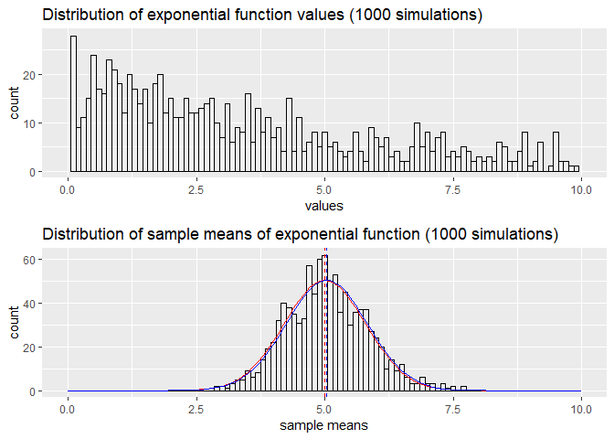

## Synopsys

This report consists of 2 parts. First one is dedicated to investigation of the the exponential distribution and its comparison with the Central Limit Theorem. Second one contains analysis of ToothGrowth data in the R datasets package.

## Exponential distribution

### Simulation

For the purpose of this investigation we run a 1000 simulations of 40 exponentials with lambda = .2, taking their mean


```r
lambda = 0.2
n = 40
nsim = 1000
mns = NULL
set.seed(2019)
for (i in 1 : nsim) {
        mns = c(mns, mean(rexp(n, lambda)))
}
```

### Mean and variance

Using the fact that mean fucntion is linear, we can calculate sample mean:

```r
mean(mns)
```

```
## [1] 5.038755
```

which is quite close to a theoretized value of 1/lambda, or 5

We can also calculate variance values

```r
setNames(data.frame(matrix(data = c(1/(lambda^2)/n, var(mns)), 
        ncol = 2, nrow = 1)), 
        c("theoretical variance", "sample variance"))
```

```
##   theoretical variance sample variance
## 1                0.625       0.6253269
```

Both mean and variance are quite close to what theory tells us and it will be shown on the plot below.

### Distribution

CLT tells us that assuming the variables are iid the distribution of means of that variable will approximate normal distribution - even if original values are not normally distributed - and its mean will estimate a population mean. Let's see it on the plot.

First we create a simulated means distribution plot


```r
bw = .1
library(ggplot2) 
library(gridExtra)

## plot a histogram of simulation means
plotmean <- ggplot(mapping = aes(mns)) + 
        geom_histogram(alpha=0.3, fill='white', colour='black', binwidth = bw)
## add a theoretical mean to a plot (dashed red line)
plotmean <- plotmean + geom_vline(xintercept = 1/lambda, 
        linetype="dashed", color = "red")
## add the sample mean 
plotmean <- plotmean + geom_vline(xintercept = mean(mns), 
        linetype="dashed", color = "blue")
## add titles
plotmean <- plotmean + labs(title = "Distribution of sample means of exponential function (1000 simulations)",
        x="sample means")

## add a normal distribution curve scaled to the sample mean distribution
tmean = 1/lambda
tsd = sqrt(1/(lambda^2)/n)

smean = mean(mns)
ssd = sd(mns)

plotnorm <- plotmean + 
        stat_function (fun = function(x, mean, sd, n){
                n * dnorm(x = x, mean = mean, sd = sd) * bw
                }, 
                args = c(mean = tmean, sd = tsd, n = nsim), color = "red") +
        stat_function (fun = function(x, mean, sd, n){
                n * dnorm(x = x, mean = mean, sd = sd) * bw
                }, 
                args = c(mean = smean, sd = ssd, n = nsim), color = "blue")
```

For truly seeing CLT in action we compare the distribution we got for plain exponentials obtained in 1000 simulations


```r
randsam <- rexp(nsim, lambda)

plotrand <- ggplot(mapping = aes(randsam)) +
                geom_histogram (alpha=0.3, fill='white', 
                        colour='black', binwidth = bw) +
        labs(title = "Distribution of exponential function values (1000 simulations)", x="values") 

## adding the scale for better redability
plotrand <- plotrand + xlim(0,10)
plotnorm <- plotnorm + xlim(0,10)

## plot 2 distributions
grid.arrange(plotrand, plotnorm, nrow = 2)
```

<!-- -->

Red bell curve represent theoretical values for the mean and variance of the distribution. The blue one uses the sample mean and variance for our initial simulation.

We can see that even though the underlying data is not normally distributed, the distribution of sample means approximate the cassic bell curve of a normal distribution.

## ToothGrowth data analysis

### Summary of data


```r
data(ToothGrowth)
str(ToothGrowth)
```

```
## 'data.frame':	60 obs. of  3 variables:
##  $ len : num  4.2 11.5 7.3 5.8 6.4 10 11.2 11.2 5.2 7 ...
##  $ supp: Factor w/ 2 levels "OJ","VC": 2 2 2 2 2 2 2 2 2 2 ...
##  $ dose: num  0.5 0.5 0.5 0.5 0.5 0.5 0.5 0.5 0.5 0.5 ...
```

Dataset "ToothGrowth" coming with R contains data on the response is the length of odontoblasts (cells responsible for tooth growth) in 60 guinea pigs. Each animal received one of three dose levels of vitamin C (0.5, 1, and 2 mg/day) by one of two delivery methods, orange juice or ascorbic acid (a form of vitamin C and coded as VC).


```r
summary(ToothGrowth)
```

```
##       len        supp         dose      
##  Min.   : 4.20   OJ:30   Min.   :0.500  
##  1st Qu.:13.07   VC:30   1st Qu.:0.500  
##  Median :19.25           Median :1.000  
##  Mean   :18.81           Mean   :1.167  
##  3rd Qu.:25.27           3rd Qu.:2.000  
##  Max.   :33.90           Max.   :2.000
```

We can see that there are no missing values and the values of len vary quite a lot. Let's see plot the data to see if there any obvious patterns


```r
qplot(supp,len,data=ToothGrowth, facets=~dose, 
        main="ToothGrowth data: length vs supplement, given the dose",
        xlab="Supplement", ylab="Tooth length") + 
        geom_boxplot(aes(fill = supp))
```

<!-- -->

We can see that for the smaller dosages orange juice seems to have more effect on tooth growth than vitamin C, but with the dosage increased to 2 mg the associated tooth growth is very similar.

### Assumptions

Since we don't know the underlying population characteristics we will have to make several assumtions:
* Population data is normally distributed
* The variables must be independent and identically distributed (i.i.d.).
* Variances of tooth growth are different when using different supplement and dosage

### Hypothesis

Let the H$_0$ be that the average tooth growth in a similar dosage by both delivery methos are equal, and the alternative H$_1$ be that orange juice is more effective. 

For the dosage of 2 mg we'll perform 2-sided test with alternative hypothesis H$_1$: mu0 <> mu1


```r
table(ToothGrowth$supp, ToothGrowth$dose)
```

```
##     
##      0.5  1  2
##   OJ  10 10 10
##   VC  10 10 10
```

Each experiment contains exactly 10 observations, so t-test will appropriate to use.

Let's also assume an acceptable alpha level at 0.05.


```r
alpha = 0.05
```

And run the t-tests for different dosages. In an essense we want to see if the difference in means of OJ experiments - VC experiments is greater than zero with 95% confidence.


```r
tl <- split(ToothGrowth, ToothGrowth$dose)

testres = NULL

for (i in c(1:2)) {
        testres[[i]] <- with(tl[[i]], 
                t.test(len[supp == "OJ"], len[supp == "VC"],
                alternative = "g"))
}

testres[[3]] <- with(tl[[3]], 
                t.test(len[supp == "OJ"], len[supp == "VC"],
                alternative = "two"))
```

Now we can arrange test results into a table and determine the hypothesis status


```r
## setting up a table for results
results <- setNames(data.frame(matrix(ncol = 7, nrow = 0)), 
        c("supp1", "supp2", "dose", "confint1", 
                "confint2", "p-value", "status"))

## creating a function to determine whether null hypothesis is rejected based on test results based on whether confidence interval contains 0, and p-value
hypo <- function (t) {
        outZero <- sign(prod(t$conf.int))
        if ((outZero != 1) || (t$p.value > alpha)) {
                "fail to reject"
        } else {
                "reject"
        }
}

## filling the data
for (i in c(1:3)) {
        results[i,"supp1"] <- "OJ"
        results[i,"supp2"] <- "VC"
        results[i,"dose"] <- tl[[i]]$dose[1]
        results[i,"confint1"] <- testres[[i]]$conf.int[1]
        results[i,"confint2"] <- testres[[i]]$conf.int[2]
        results[i,"p-value"] <- testres[[i]]$p.value
        results[i,"status"] <- hypo(testres[[i]])
}
```

### Conclusions
As a result of t-tests performed on the data we can colnclude that:
* For the smaller dosages (0.5, 1 mg) the tooth growing effect of orange juice is greater than that of vitamin C with p-values of NA and NA respectively
* for the bigger dosage (2 mg) we failed to reject the hypothesis that both supplrements have similar effect, and there's no reason to assume that effects of vitamin C and orange juice vary
