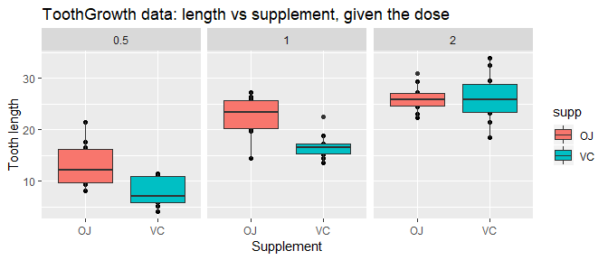

## Synopsys

This report contains exploratory analysis of the tooth growth data and investigates statistical significance of reported effects.


## Summary of data


```r
data(ToothGrowth)
str(ToothGrowth)
```

```
## 'data.frame':	60 obs. of  3 variables:
##  $ len : num  4.2 11.5 7.3 5.8 6.4 10 11.2 11.2 5.2 7 ...
##  $ supp: Factor w/ 2 levels "OJ","VC": 2 2 2 2 2 2 2 2 2 2 ...
##  $ dose: num  0.5 0.5 0.5 0.5 0.5 0.5 0.5 0.5 0.5 0.5 ...
```

Dataset "ToothGrowth" coming with R contains data on the response is the length of odontoblasts (cells responsible for tooth growth) in 60 guinea pigs. Each animal received one of three dose levels of vitamin C (0.5, 1, and 2 mg/day) by one of two delivery methods, orange juice or ascorbic acid (a form of vitamin C and coded as VC).


```r
summary(ToothGrowth)
```

```
##       len        supp         dose      
##  Min.   : 4.20   OJ:30   Min.   :0.500  
##  1st Qu.:13.07   VC:30   1st Qu.:0.500  
##  Median :19.25           Median :1.000  
##  Mean   :18.81           Mean   :1.167  
##  3rd Qu.:25.27           3rd Qu.:2.000  
##  Max.   :33.90           Max.   :2.000
```

There don't seem to be any missing values and the values of len vary quite a lot. Let's plot the data to see if there are any obvious patterns


```r
library(ggplot2) 

qplot(supp,len,data=ToothGrowth, facets=~dose, 
        main="ToothGrowth data: length vs supplement, given the dose",
        xlab="Supplement", ylab="Tooth length") + 
        geom_boxplot(aes(fill = supp))
```

<!-- -->

For the smaller dosages orange juice seems to have more effect on tooth growth than vitamin C, but with the dosage increased to 2 mg the associated tooth growth is very similar.

## Assumptions

Since we don't know the underlying population characteristics we will have to make several assumtions:

* Population data is normally distributed
* The variables must be independent and identically distributed (i.i.d.).
* Variances of tooth growth are different when using different supplement and dosage

## Hypothesis

Let the H$_0$ be that the average tooth growth in a given dosage for both supplements are equal, and the alternative H$_1$ be that orange juice is more effective in smaller dosages (0.5, 1). 

For the dosage of 2 mg we'll perform 2-sided test with alternative hypothesis H$_1$: mu0 <> mu1


```r
table(ToothGrowth$supp, ToothGrowth$dose)
```

```
##     
##      0.5  1  2
##   OJ  10 10 10
##   VC  10 10 10
```

Each experiment contains exactly 10 observations, so t-test will be appropriate to use.

Let's also assume an acceptable alpha level at 0.05.


```r
alpha = 0.05
```

And run the t-tests for different dosages. In an essense we want to see if the difference in means of OJ experiments - VC experiments is greater than zero with 95% confidence.


```r
tl <- split(ToothGrowth, ToothGrowth$dose)

testres = NULL

for (i in c(1:2)) {
        testres[[i]] <- with(tl[[i]], 
                t.test(len[supp == "OJ"], len[supp == "VC"],
                alternative = "g"))
}

testres[[3]] <- with(tl[[3]], 
                t.test(len[supp == "OJ"], len[supp == "VC"],
                alternative = "two"))
```

Now we can arrange test results into a table and determine the hypothesis status


```r
## setting up a table for results
results <- setNames(data.frame(matrix(ncol = 7, nrow = 0)), 
        c("supp1", "supp2", "dose", "confint1", 
                "confint2", "p-value", "status"))

## creating a function to determine whether null hypothesis is rejected based on test results based on whether confidence interval contains 0, and p-value
hypo <- function (t) {
        outZero <- sign(prod(t$conf.int))
        if ((outZero != 1) || (t$p.value > alpha)) {
                "fail to reject"
        } else {
                "reject"
        }
}

## filling the data
for (i in c(1:3)) {
        results[i,"supp1"] <- "OJ"
        results[i,"supp2"] <- "VC"
        results[i,"dose"] <- tl[[i]]$dose[1]
        results[i,"confint1"] <- testres[[i]]$conf.int[1]
        results[i,"confint2"] <- testres[[i]]$conf.int[2]
        results[i,"p-value"] <- testres[[i]]$p.value
        results[i,"status"] <- hypo(testres[[i]])
}

results
```

```
##   supp1 supp2 dose  confint1 confint2      p-value         status
## 1    OJ    VC  0.5  2.346040      Inf 0.0031793034         reject
## 2    OJ    VC  1.0  3.356158      Inf 0.0005191879         reject
## 3    OJ    VC  2.0 -3.798070  3.63807 0.9638515887 fail to reject
```

## Conclusions
As a result of t-tests performed on the data we can colnclude that:
* For the smaller dosages (0.5, 1 mg) the tooth growing effect of orange juice is greater than that of vitamin C with p-values of NA and NA respectively
* for the bigger dosage (2 mg) we failed to reject the hypothesis that both supplrements have similar effect, and there's no reason to assume that effects of vitamin C and orange juice vary

### Environment data

```r
sessionInfo()
```

```
## R version 3.5.1 (2018-07-02)
## Platform: x86_64-w64-mingw32/x64 (64-bit)
## Running under: Windows 10 x64 (build 17134)
## 
## Matrix products: default
## 
## locale:
## [1] LC_COLLATE=English_United States.1252 
## [2] LC_CTYPE=English_United States.1252   
## [3] LC_MONETARY=English_United States.1252
## [4] LC_NUMERIC=C                          
## [5] LC_TIME=English_United States.1252    
## 
## attached base packages:
## [1] stats     graphics  grDevices utils     datasets  methods   base     
## 
## other attached packages:
## [1] ggplot2_3.1.0
## 
## loaded via a namespace (and not attached):
##  [1] Rcpp_0.12.19     bindr_0.1.1      knitr_1.20       magrittr_1.5    
##  [5] tidyselect_0.2.5 munsell_0.5.0    colorspace_1.3-2 R6_2.3.0        
##  [9] rlang_0.3.0.1    stringr_1.3.1    plyr_1.8.4       dplyr_0.7.8     
## [13] tools_3.5.1      grid_3.5.1       gtable_0.2.0     withr_2.1.2     
## [17] htmltools_0.3.6  assertthat_0.2.0 yaml_2.2.0       lazyeval_0.2.1  
## [21] rprojroot_1.3-2  digest_0.6.18    tibble_1.4.2     crayon_1.3.4    
## [25] bindrcpp_0.2.2   purrr_0.2.5      codetools_0.2-15 glue_1.3.0      
## [29] evaluate_0.12    rmarkdown_1.10   labeling_0.3     stringi_1.2.4   
## [33] compiler_3.5.1   pillar_1.3.0     scales_1.0.0     backports_1.1.2 
## [37] pkgconfig_2.0.2
```
